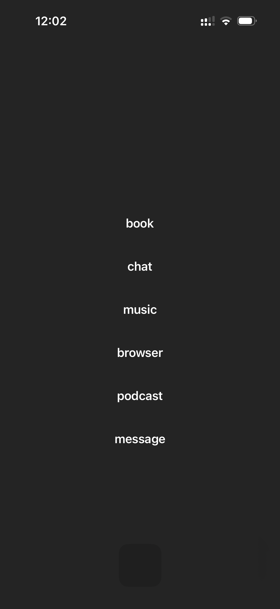

# Tranquil

Do you ever find yourself wishing you were more addicted to your phone? Wait.. you don't? In that case this app might be for you! Tranquil is a simple app that allows you to make your home screen boring.

## Getting Started

1. Change phone background
- Set both your lock screen and home screen background to a grayscale image to reduce visual stimulation. You can download the recommended [gray background image here](doc/gray_background.PNG).
2. Enable dark mode
- Optional, but highly recommended. This will make the widget appear hidden. Change it in [Settings] -> [Display & Brightness] -> Dark
3. Install and configure Tranquil
- Open Tranquil.xcodeproj in Xcode and run the app on your phone.
- Launch the app and add up to six links or apps that you frequently use
4. Set up the shortcut
- Download [TranquilOpenApp.shortcut](doc/TranquilOpenApp.shortcut) install it on your iPhone. This can be done by AirDropping it.
- Modify the shortcut actions in the Shortcuts app on your iPhone to correspond with the links you've set up in the Tranquil app. This enables the shortcut to launch apps or do any other actions directly from your home screen. Note that it is case sensitive.
5. Configure your home screen
- Clear your home screen of all apps
- Place the Tranquil widgets on your home screen for quick access to essential features. Start with an empty 2x2 widget in the top left corner followed by a larger 4x4 widget directly below
- Optionally, create a docked folder for apps that require notification visibility but should remain less accessible. Place the Tranquil app on the first page of this folder and other notification-sensitive apps on the second page
